# Green Fork – Restaurant App MVP

**Developed by:** Muhammad Wasim
**Course:** Mobile Application Development – Assignment 1 (Fall 2026)

A frontend-only React Native (Expo) prototype of a restaurant app. Customers can browse the menu, search, favourite dishes, build a cart with promo codes, place Dine-in or Takeaway orders and follow them live, and reserve a table. Managers run the restaurant from a dashboard: incoming orders, reservation approvals and menu management. The app opens with an animated Green Fork launch screen.
There is no backend, no external API and no state-management library. All data is mock data held in React state and Context, and orders, reservations and menu edits are saved on the phone with AsyncStorage.

---

## Installation

| Requirement | Version used |
|---|---|
| Node.js | v26.8.2 (v20 LTS or newer works) |
| npm | 11.19.1 |
| Expo SDK | 57 |
| Test device | iPhone with the **Expo Go** app |

```bash
# 1. Clone the repository
git clone https://github.com/wasikayani/restaurant-app-mvp.git
cd restaurant-app-mvp

# 2. Install dependencies
npm install

# 3. Start the Expo development server
npx expo start

# 4. (optional) Run the unit tests
npm test
```

**Run on a phone (Expo Go):** install *Expo Go* from the App Store or Play Store. Connect the phone to the same Wi-Fi as the computer, then scan the QR code shown in the terminal. On iPhone, use the Camera app; on Android, use Expo Go.
If the phone cannot connect, run `npx expo start --tunnel`.

**Run on an emulator:** with Android Studio's emulator open, press `a` in the terminal. On a Mac with Xcode, press `i` to open the iOS Simulator.

---

## Mock login credentials

| Role | Email | Password |
|---|---|---|
| Customer | customer@greenfork.pk | customer123 |
| Manager | manager@greenfork.pk | manager123 |

New accounts can also be created on the Sign Up tab. They last only while the app is open.

**Reset demo data:** log in as the manager, open Profile and tap *Reset demo data* to go back to the original orders, reservations and menu.

**Promo codes:** `WELCOME10` (10% off) and `FEAST20` (20% off).

---

## Project structure

```
restaurant-app-mvp/
├── App.js              providers (Theme, Auth, Menu, Reservations, Orders) + navigator + launch/loading screen
├── assets/             app icon, splash icon and brand logo layers
├── __tests__/          Jest unit tests (cart reducer, order totals, reservation rules, orders reducer)
├── notes/              written notes for Q4, Q6, Q7, Q8
├── screenshots/        screenshots used in this README
└── src/
    ├── components/     reusable UI (BrandSplash, FormInput, MenuItemCard, OrderStatusBadge, dashboard/ panels, ...)
    ├── screens/        Login, Menu, Cart, OrderSummary, OrderTracking, MyOrders, Reservation, MyReservations, Profile, Dashboard
    ├── context/        AuthContext, ThemeContext, CartContext, MenuContext, ReservationContext, OrdersContext
    ├── reducers/       cartReducer, ordersReducer
    ├── hooks/          custom hooks: useForm, useDebounce, useReservation (Q9), usePersistence (Q10)
    ├── data/           mock data (users, menu, tables, reservations)
    ├── navigation/     bottom tabs + nested stacks
    ├── theme/          light and dark colour palettes
    └── utils/          pure helpers (order totals, reservation rules, AsyncStorage wrapper)
```

---

## Hooks used per screen

| Screen / file | Hooks | Why |
|---|---|---|
| LoginScreen (Q3, Q6, Q9) | useState, useContext (useAuth, useTheme), **useForm** | mode, show-password, isSubmitting, success popup; form values and errors come from the custom useForm hook; stores the user in AuthContext |
| MenuScreen (Q4, Q5, Q8) | useState, useEffect, useRef, useMemo, useCallback, useContext | load the menu with cleanup, header count, search input and FlatList refs, search debounced with the custom **useDebounce** hook (Q9), render counter, one memoised filter/search/sort list, stable handlers |
| MenuItemCard (Q8) | React.memo, useContext | re-renders only when its own props change |
| MenuSkeleton | useState, useEffect | pulsing loading animation with cleanup |
| ProfileScreen (Q6) | useContext (useAuth, useTheme) | shows the user and toggles dark mode |
| CartScreen (Q7) | useReducer (via useCart), useState, useContext | all cart changes are dispatched actions; promo input state |
| OrderSummaryScreen (Q8) | useMemo, useContext | totals recalculated only when items or discount change |
| AuthContext / ThemeContext (Q6) | createContext, useState, useContext | global user and theme with useAuth / useTheme hooks |
| CartContext (Q7) | useReducer, useContext | shared cart with the useCart hook |
| ReservationScreen (Q9) | **useReservation**, useState, useContext | UI only: date, guests, time slot, table, contact form and confirmation modal; all logic lives in the hook |
| MyReservationsScreen (Q9) | **useReservation**, useContext | lists the customer's bookings and cancels them |
| useForm (Q9, custom) | useState, useRef | reusable form state: values, errors, handleChange, handleSubmit, reset |
| useDebounce (Q9, custom) | useState, useEffect | returns a value only after the user stops typing (cleanup clears the timer) |
| useReservation (Q9, custom) | useForm, useMemo, useContext | available slots, free tables, validation, create and cancel reservations |
| ReservationContext (Q9) | createContext, useState, useContext | app-wide bookings, so the manager can see them in Q10 |
| OrderSummaryScreen (Q10) | useState, useEffect, useContext (useOrders, useCart) | Dine-in (table) or Takeaway (pickup time), places the order, clears the cart, opens tracking |
| OrderTrackingScreen (Q10) | useEffect + **setInterval**, useState, useContext | Pending → Preparing (10s) → Ready (20s) → Served (30s), step progress, elapsed timer, clearInterval cleanup |
| MyOrdersScreen (Q10) | useMemo, useContext | the customer's orders, active first |
| DashboardScreen (Q10) | useState, useMemo, useContext | manager tabs: Orders, Bookings, Menu, with live overview numbers |
| OrdersContext (Q10) | **useReducer**, useCallback, useContext | all orders (id, items, total, type, status, timestamp) via ordersReducer |
| MenuContext (Q10) | useState, useCallback, useContext | one shared menu: manager edits show on the customer menu instantly |
| usePersistence (Q10, custom) | useState, useEffect | loads state from AsyncStorage on start and saves every change |
| BrandSplash | useState, useEffect | animated launch screen, also the loading screen until saved data is loaded |

---

## Screenshots

### Q3 – Login and Signup

| Login | Signup | Validation errors | Successful login |
|---|---|---|---|
| 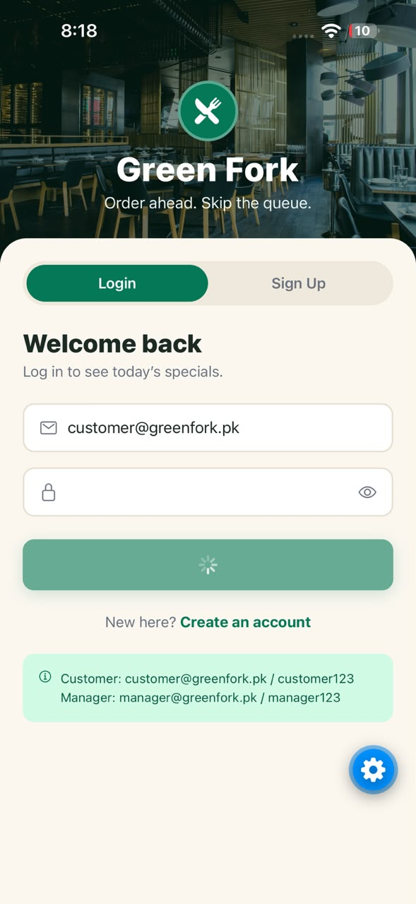 | 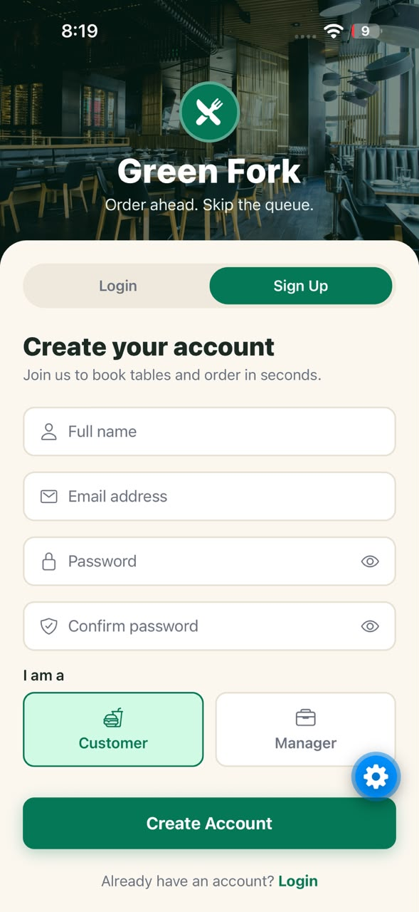 |  | 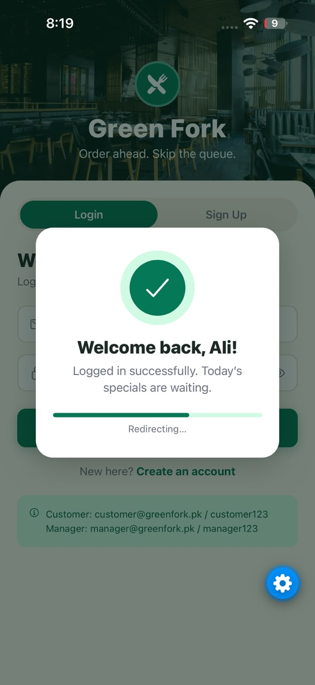 |

### Q4 – Menu browsing

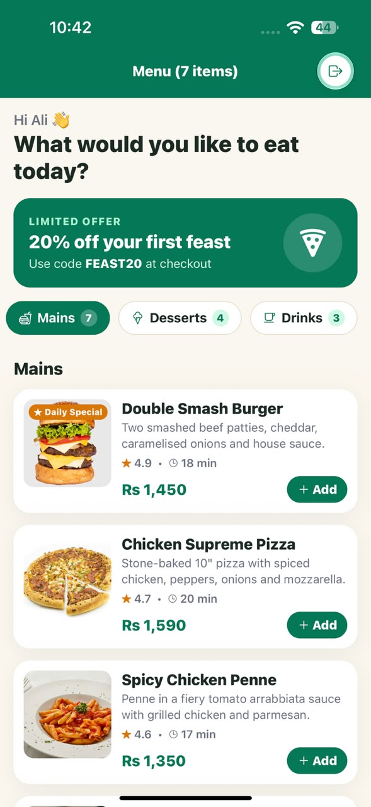

### Q5 – Search and render counter

| Render counter after searching "cake" | Render counter on the menu |
|---|---|
| 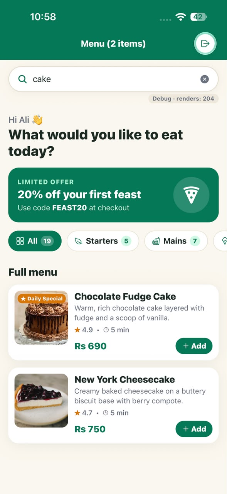 | 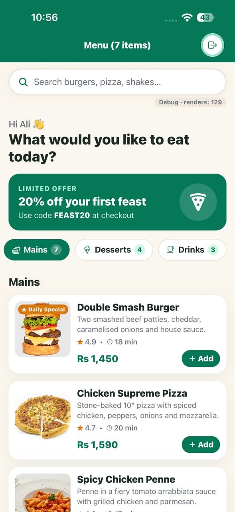 |

### Q6 – Profile, dark mode and role-based tabs

| Profile (dark mode) | Menu (dark mode, manager) | Manager Dashboard |
|---|---|---|
| 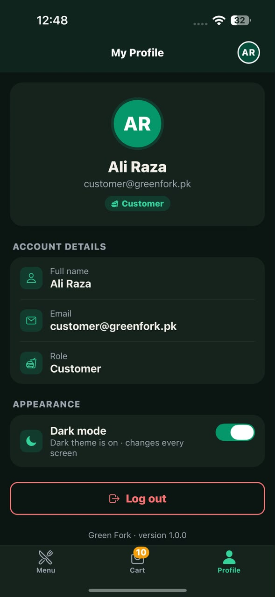 | 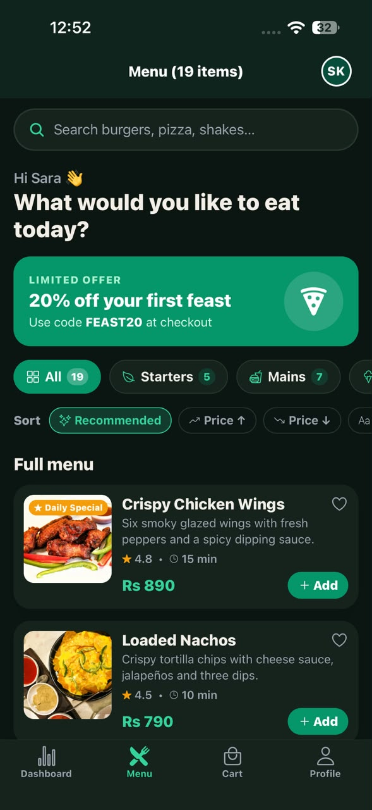 | 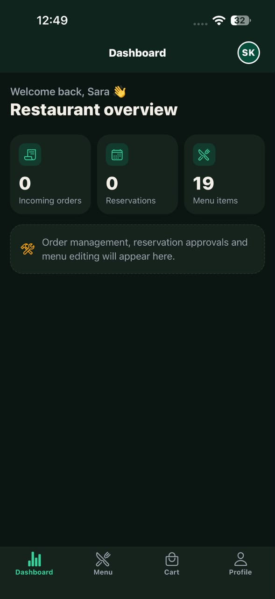 |

### Q7 – Cart and Q8 – Order Summary

| Cart (useReducer) | Order Summary (useMemo) |
|---|---|
| 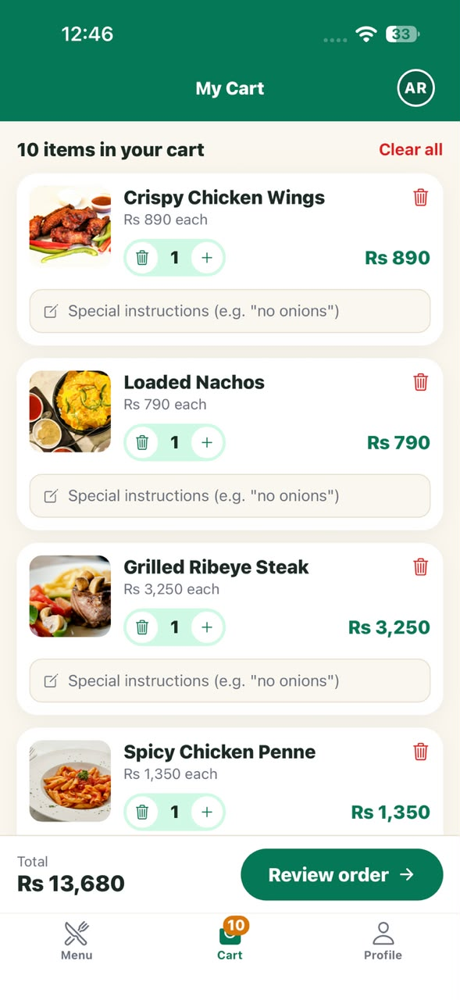 | 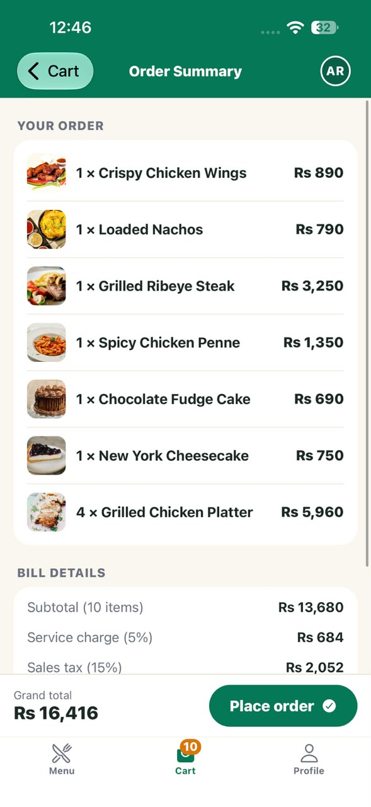 |

### Q8 – React.memo proof (console)

**Before optimisation:** tapping one heart re-renders every card.

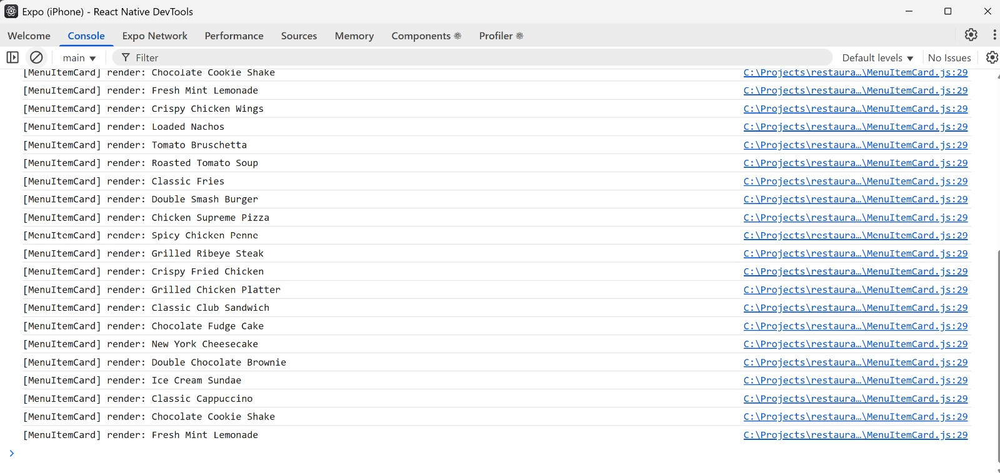

**After optimisation (React.memo + useCallback):** only the tapped card re-renders.

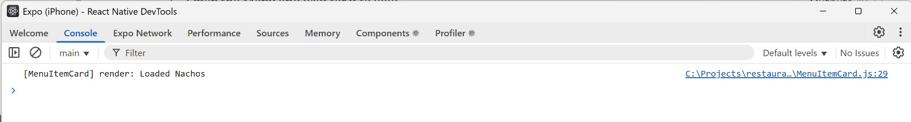

### Q9 – Table reservation (custom hooks)

| Booked slots disabled (Tomorrow, 6 guests) | My Reservations |
|---|---|
| 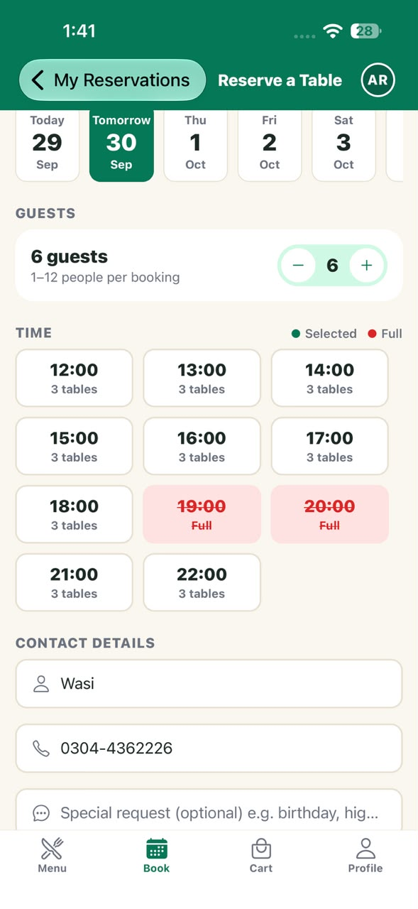 | 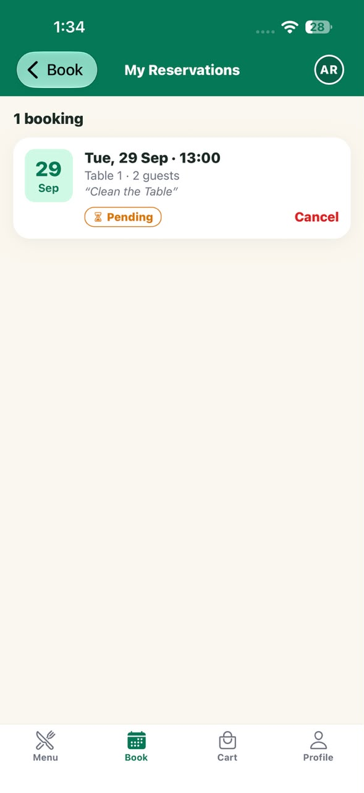 |

### Q10 – Orders, live tracking and Manager Dashboard

| Dine-in or Takeaway | Live order tracking | Manager: incoming orders |
|---|---|---|
| 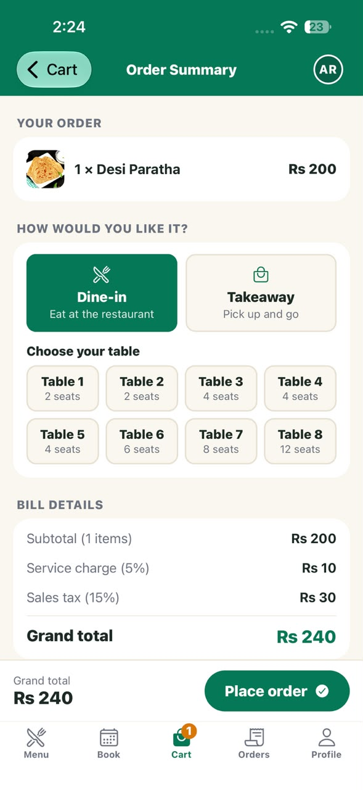 | 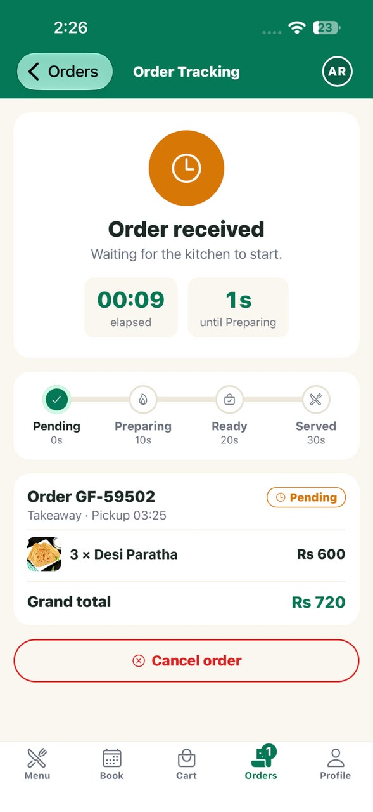 | 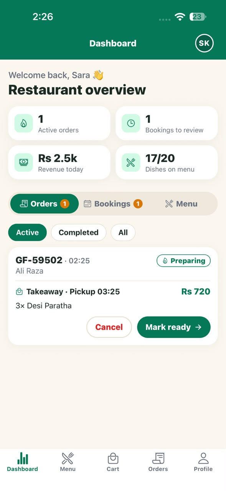 |

| Manager: reservations | Manager: menu management | Manager: add a new dish |
|---|---|---|
| 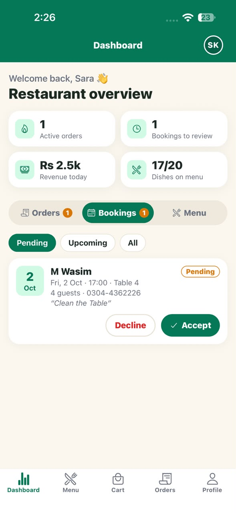 | 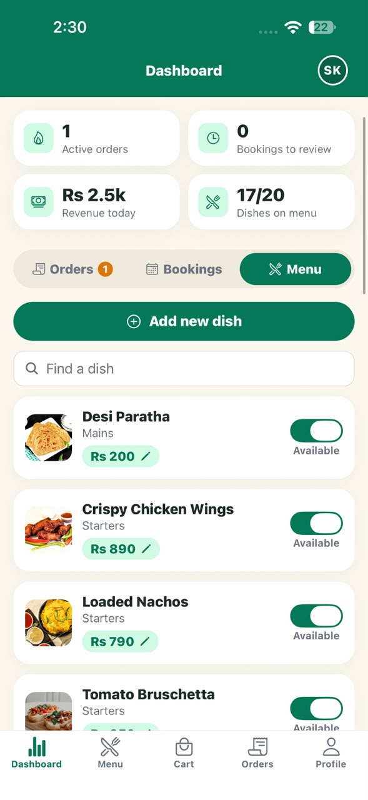 | 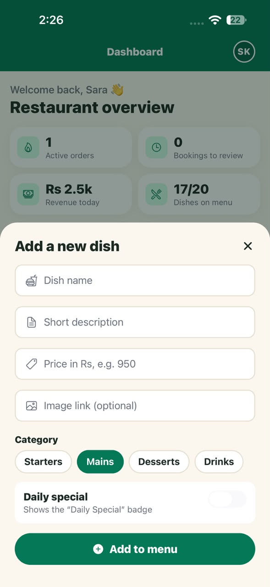 |

### Unit tests

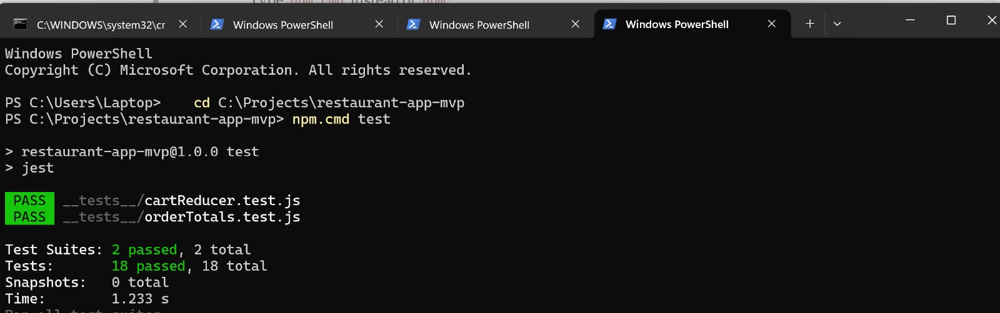

---

## Assignment notes

### Q4 – What if the filter effect's dependency array is empty?

The filtering effect in `MenuScreen.js` is written as
`useEffect(() => { ...setFilteredItems(...) }, [selectedCategory, menuItems])`.

If its dependency array were left empty (`[]`), React would run the effect only once, right after the first render. At that moment `menuItems` is still an empty array, because the 1.5-second "fetch" has not finished yet. So `filteredItems` would be set to `[]` and never updated again.

The result: the screen would stay empty after loading, and tapping a category chip would change `selectedCategory` but not the list. The effect would keep using the **stale values** captured during the first render.

Listing `selectedCategory` and `menuItems` tells React to re-run the filter whenever either value changes, so the list always matches the current data and selection.

*(≈110 words)*

### Q6 – Why Context instead of prop drilling

The logged-in user and the light/dark theme are needed by almost every screen: Login, Menu, Profile, Dashboard, the header avatar and the account menu.
With prop drilling, `App` would have to pass `user` and `colors` down through the navigator, every tab, every stack and every component, even components that do not use them and only forward them.
Context puts this data in one Provider at the top of the app. Any component can read it directly with `useAuth()` or `useTheme()`, however deep it is in the tree.
This keeps components independent and easier to move or reuse. Logging out or toggling dark mode in one place instantly updates every screen that uses the data.

**Drawback:** when a context value changes, every component that consumes that context re-renders, even if it only uses part of the value. For example, toggling the theme re-renders every screen that calls `useTheme()`. For data that changes very often, this can hurt performance, so context is best for "global and rarely changing" data like auth and theme.

### Q7 – Cart reducer test cases

Burger = `{ id: 'm6', price: 1450 }`, Shake = `{ id: 'm18', price: 590 }`.
All cases are automated in `__tests__/cartReducer.test.js` (run `npm test`: 14 tests, all passing).

| # | Action | Initial state | Expected state |
|---|--------|---------------|----------------|
| 1 | `ADD_ITEM` (Burger) | `items: []` | `items: [{ Burger, quantity: 1, note: '' }]` |
| 2 | `ADD_ITEM` (Burger) | `items: [Burger ×1]` | `items: [Burger ×2]` (no duplicate line) |
| 3 | `INCREMENT` (Shake) | `items: [Shake ×2]` | `items: [Shake ×3]` |
| 4 | `DECREMENT` (Shake) | `items: [Shake ×3]` | `items: [Shake ×2]` |
| 5 | `DECREMENT` (Burger) | `items: [Burger ×1, Shake ×2]` | `items: [Shake ×2]` (Burger removed at zero) |
| 6 | `REMOVE_ITEM` (Burger) | `items: [Burger ×4, Shake ×1]` | `items: [Shake ×1]` |
| 7 | `UPDATE_NOTE` (Burger, "no onions") | `items: [Burger, note: '']` | `items: [Burger, note: 'no onions']` |
| 8 | `APPLY_PROMO` (" feast20 ") | `promoCode: null, discountPercent: 0` | `promoCode: 'FEAST20', discountPercent: 20` |
| 9 | `APPLY_PROMO` ("FREE100") | `promoCode: null, discountPercent: 0` | unchanged (same object); the screen shows an error message |
| 10 | `REMOVE_PROMO` | `promoCode: 'WELCOME10', discountPercent: 10` | `promoCode: null, discountPercent: 0` |
| 11 | `CLEAR_CART` | `items: [Burger ×2, Shake ×1], promoCode: 'FEAST20'` | `{ items: [], promoCode: null, discountPercent: 0 }` |
| 12 | Any action on a frozen state | frozen state object | previous state is not mutated (purity check) |

### Q7 – useReducer vs useState

The cart has several related pieces of state (items, quantities, notes, promo code and discount) and eight different ways to change them.
With `useState` this logic would be spread across many setter calls inside the screens, and it would be easy to forget a rule, for example removing an item when its quantity reaches zero.
`useReducer` puts every transition in one pure function, so the screens only `dispatch` an action that describes *what happened*. The reducer is also easy to test without any UI, which is exactly what the Jest tests do.
`useState` would have been enough for a very simple cart, such as a single item count or a list where you only add and remove items, with no quantities, notes or promo codes.

### Q8 – When not to use useMemo and useCallback

`useMemo` and `useCallback` are not free. Each one stores a cached value and compares its dependency array on every render, and it makes the code harder to read.

Do not use them when:

- **The calculation is cheap**, such as adding two numbers or formatting a string. Recalculating is faster than caching.
- **The function is passed to a normal element** like `<TouchableOpacity>`, or to a child that is *not* wrapped in `React.memo`. A stable reference changes nothing there.
- **The dependencies change on almost every render**, so the cache is thrown away anyway.
- **There is no measured problem.** Optimise only after you see slow renders, for example with a render counter or console logs.

In this app they are used only where it matters: filtering and sorting the menu list, the order totals, and the handlers passed to the memoised `MenuItemCard`.

*(≈140 words)*

#### Proof (before and after)

| Situation | Cards re-rendered after tapping ONE heart |
|---|---|
| Before: `ENABLE_MEMO = false` (no `React.memo`, new handler functions every render) | **19** (every card) |
| After: `React.memo` and `useCallback` | **1** (only the tapped card) |

### Q9 – Reservation rules

Mock bookings are dated relative to today, so the demo always works:

| Rule | How it is shown |
|---|---|
| A slot is **Full** when every table big enough for the party is booked | Tomorrow with 5+ guests: 19:00 and 20:00 are crossed out in red |
| Bookings must be at least **1 hour ahead** | past or too-soon slots today are greyed out as *Closed* |
| Party size **1–12** | the guest stepper stops at the limits |
| Phone must be **03XX-XXXXXXX** | the dash is added automatically; wrong numbers show an error |
| Cancelled bookings free the table again | covered in `__tests__/reservationRules.test.js` |

Reservation rules are covered by 11 tests in `__tests__/reservationRules.test.js`. (In PowerShell use `npm.cmd test`.)

### Q10 – Orders, Manager Dashboard and persistence

**Full flow:** customer adds dishes → Cart → Order Summary → chooses **Dine-in** (table) or **Takeaway** (pickup time) → *Place order* → the order is added to `OrdersContext` with status **Pending** → **Order Tracking** opens. The manager sees the order in **Dashboard › Orders** and can move it forward or cancel it; the customer's screen updates instantly because both use the same reducer.

| Order status | When |
|---|---|
| Pending | as soon as the order is placed |
| Preparing | after 10 seconds (or when the manager taps *Start preparing*) |
| Ready | after 20 seconds (*Mark ready*) |
| Served | after 30 seconds (*Mark served*) |
| Cancelled | customer or manager cancels while Pending or Preparing |

- The timer is a `setInterval` that ticks every second and is cleared (`clearInterval`) when the screen closes or the order is Served/Cancelled. Elapsed time comes from the order's timestamp, so it is still correct after a restart.
- **Dashboard › Bookings:** accept or decline Pending reservations; the customer sees *Confirmed* or *Declined* in My Reservations.
- **Dashboard › Menu:** add a dish (validated with `useForm`), edit a price, switch a dish on/off. The customer menu updates immediately (unavailable dishes show *N/A*).
- **AsyncStorage:** orders, reservations and menu edits are saved under `@greenfork/orders`, `@greenfork/reservations` and `@greenfork/menu`. On start the launch screen stays until they are loaded.

Run `npm test`: 4 test suites, **40 tests** (11 for the orders reducer), all passing.

---

## Demo video

*The link will be added after Question 10.*
