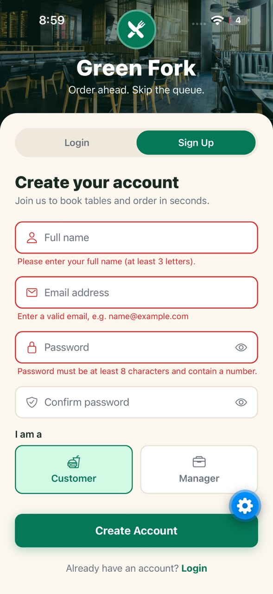

# Green Fork – Restaurant App MVP

A frontend-only React Native (Expo) prototype of a restaurant app. Customers can browse the menu, book a table and place an order. Managers can handle orders, reservations and the menu.
Assignment 1 – Fall 2026. No backend, no external API and no state-management library: all data is mock data held in React state.

---

## Installation

| Requirement | Version used |
|---|---|
| Node.js | v26.8.2 (v20 LTS or newer works) |
| npm | 11.19.1 |
| Expo SDK | 57 |
| Test device | iPhone with the **Expo Go** app |

```bash
# 1. Clone the repository
git clone https://github.com/wasikayani/restaurant-app-mvp.git
cd restaurant-app-mvp

# 2. Install dependencies
npm install

# 3. Start the Expo development server
npx expo start
```

**Run on a phone (Expo Go):** install *Expo Go* from the App Store or Play Store. Connect the phone to the same Wi-Fi as the computer, then scan the QR code shown in the terminal. On iPhone, use the Camera app; on Android, use Expo Go.
If the phone cannot connect, run `npx expo start --tunnel`.

**Run on an emulator:** with Android Studio's emulator open, press `a` in the terminal. On a Mac with Xcode, press `i` to open the iOS Simulator.

---

## Mock login credentials

| Role | Email | Password |
|---|---|---|
| Customer | customer@greenfork.pk | customer123 |
| Manager | manager@greenfork.pk | manager123 |

New accounts can also be created on the Sign Up tab. They last only while the app is open.

---

## Project structure

```
src/
├── components/   reusable UI (FormInput, SuccessModal, …)
├── screens/      one file per screen
├── context/      Context providers (Auth, Theme, Cart, Orders)
├── reducers/     pure reducer functions
├── hooks/        custom hooks
├── data/         mock data (users, menu, tables, reservations)
├── navigation/   React Navigation setup
└── theme/        light and dark colour palettes
```

---

## Hooks used per screen

| Screen / file | Hooks | Why |
|---|---|---|
| LoginScreen (Q3) | useState | mode, form values, errors, showPassword, isSubmitting, success popup |

*(This table grows with each question.)*

---

## Screenshots

### Q3 – Login and Signup

| Login screen | Signup screen |
|---|---|
|  |  |

| Validation errors | Successful login |
|---|---|
|  |  |

---

## Demo video

*Link will be added after Question 10.*
